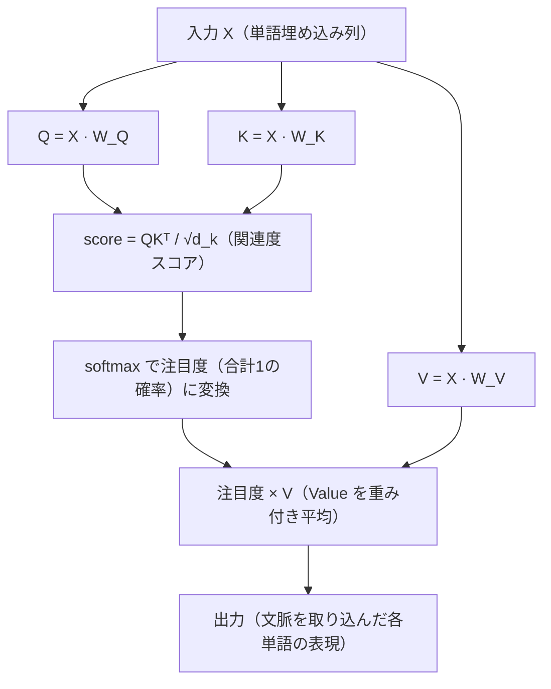

# Chapter 1: LLM のための数学基礎

LLM（大規模言語モデル）の中身は、突き詰めると **「数を並べて、掛けて、足して、確率に変える」** という数学の積み重ねでできています。Transformer も Attention も、特別な魔法ではなく、ここで学ぶベクトル・行列・指数関数・確率といった基礎の組み合わせです。

この章では、LLM をゼロから理解・実装するために必要な数学を、**前提知識ゼロから**ていねいに積み上げていきます。各トピックは次の流れで説明します。

1. **直感** … その概念が「何のためにあるのか」をイメージでつかむ
2. **数式** … 正確な定義を式で押さえる
3. **具体例** … 実際の数値で手を動かして確かめる
4. **コード** … NumPy / PyTorch でどう書くかを見る
5. **LLM での使われ方** … その数学が LLM のどこに出てくるかをつなぐ

:::tip[本書について]

このドキュメントは、書籍 **「作ってわかる大規模言語モデルの仕組み」** の輪読会メモをベースに構成しています。書籍で扱うソースコードはこちらです。

[https://github.com/elith-co-jp/book-llm-from-scratch](https://github.com/elith-co-jp/book-llm-from-scratch)

:::

## この章で学ぶこと

この章で扱うのは、厳密には **「数学そのもの」** と、**「その数学を使って作られる関数・扱うための道具」** の2種類です。両者は別物ですが、LLM を理解・実装するにはどちらも欠かせないので、区別したうえでまとめて学びます。

**LLM を支える数学そのもの**

- **スカラー・ベクトル・行列・テンソル** … データを数で表現する入れ物
- **内積とコサイン類似度** … 「2つのデータがどれくらい似ているか」を測る
- **行列積・転置** … 大量の内積を一度に計算する／次元を入れ替える
- **線形変換と非線形変換** … テンソルを掛けて空間を変形する
- **総和記号 Σ と指数関数 exp** … 後述の softmax を組み立てる部品
- **微分・偏微分・三角関数** … 学習（最適化）と幾何の道具

**数学を使って作られる「関数」**（数学そのものではなく、上記の数学を組み合わせた応用）

- **判別関数・シグモイド・softmax** … exp や Σ を組み合わせ、出力を「確率」に変える関数

**数学を扱うための「道具」**（数学ではなくライブラリ・実装テクニック）

- **NumPy によるテンソル操作・ブロードキャスト** … 数学をコードで計算するためのライブラリ機能

**（応用）内積アテンション**

- 以上の数学・関数がどう組み合わさって Transformer になるか

## この数学が、LLM のどこで使われるのか（全体マップ）

「数学を勉強しても、結局 LLM のどこで使うの？」という疑問が一番のつまずきポイントです。そこで先に、**各数学基礎が LLM を構成するどの要素に効いてくるのか**を一覧にしておきます。各節の最後にも「LLM とのつながり」を書いていますが、まずはこの地図を頭に入れてから読み進めると、迷子になりません。

**種別** … 🔢 数学そのもの／🧩 数学で作る関数／🛠️ 数学を扱う道具

| 種別 | この章で学ぶ項目 | LLM を作る要素 | 何のために使うか |
| --- | --- | --- | --- |
| 🔢 | ベクトル・行列・**テンソル** | **単語埋め込み（embedding）** / 入力・中間表現の入れ物 | 単語や文章を「数の並び」に変え、計算できるようにする |
| 🔢 | **内積・コサイン類似度** | **Attention の関連度スコア** / 単語の意味の近さ | 「どの単語とどの単語が関係するか」を数値で測る |
| 🔢 | **行列積・転置** | **Self-Attention の $QK^T$** / 全結合層 | 大量の単語ペアの関連度（内積）を一度に計算する |
| 🔢 | **線形変換（重み行列）** | **Q・K・V の生成** $Q=XW_Q$ ほか / 各層の変換 | 入力を別の表現空間へ変換する。学習対象そのもの |
| 🔢 | 非線形（$x^2$ など） | **活性化関数** / モデルの表現力 | 直線では表せない複雑な関係を学習可能にする |
| 🔢 | **Σ・指数関数 exp** | **softmax の中身** | スコアを「すべて正・合計1」の確率へ変える部品 |
| 🔢 | **微分・偏微分** | **学習（勾配降下・誤差逆伝播）** | 損失を小さくする方向（傾き）を求めてパラメータを更新 |
| 🔢 | **三角関数（sin・cos）** | **位置エンコーディング** / 内積の証明・回転 | 「何番目の単語か」という位置情報を波の形で表す |
| 🧩 | **softmax** | **出力層（次の単語の予測）** / Attention の注目度 | 数万語の候補を確率分布に変える／注目度を確率化する |
| 🧩 | **シグモイド・判別関数** | **2値分類** / 各種ゲート | 出力を 0〜1 の確率に押し込め、はい/いいえを判定 |
| 🛠️ | **NumPy・ブロードキャスト・転置操作** | **実装全般**（PyTorch / NumPy） | 次元を合わせてバグなくテンソルを掛け合わせる |

:::note[「数学」「関数」「道具」は別物]

表の **🧩 softmax・シグモイド** は、数学そのものではなく **🔢 の数学（exp や Σ）を組み合わせて作った関数**です。また **🛠️ NumPy** は数学ではなく、その計算を**コードで実行するためのライブラリ（道具）**です。この章ではタイトルこそ「数学基礎」ですが、LLM 実装に直結するこれらの関数・道具もあわせて扱います。

:::

:::tip[読み方のコツ]

🔢 の数学はおおむね **「データを数にする → 関連度を測る → 変換する → 確率の部品にする → 学習する」** という LLM の処理の流れの順に並んでいます。「いま地図のどこを学んでいるのか」を意識すると、Transformer 全体像の中での位置づけが見えてきます。

:::

## はじめに：本書の流れと読み進め方

LLM の教科書は、おおまかに次のリズムで進みます。

> **説明 → 関数 → 目的変数**

LLM が扱うのは「文章」「言葉」という、本来コンピュータには直接計算できないものです。そこで、

- まず対象（言葉・文章）を **説明**（どういうデータか）し、
- それを **関数** で処理できる形に変え、
- 最終的に予測したい **目的変数**（次の単語など）にたどり着く

という流れになります。説明パートで言葉に対する説明が多くなるのは、**言葉をベクトル（数の並び）という変数に変換するため**です。言葉を数にできれば、あとはこの章で学ぶ数学がすべて使えるようになります。

:::note[読み進め方の方針]

- **進む頻度は遅くて良いので、理解しながら進む**ことを優先してください。
- 各節の **数式とアーキテクチャ図を中心に読み込み**、「なぜその構造が必要なのか」という理論的背景に注目すると、自分の言葉で説明できるようになります。
- 後続の章で出てくる **Transformer の理解が最重要**です。本章の数学は、そこを重点的に理解するための土台になります。

:::

---

## 1. 数とデータの表現：スカラー・ベクトル・行列・テンソル

LLM の計算は、すべて「数の入れ物」の上で行われます。まずはその入れ物の種類を整理しましょう。

### 1.1 スカラー・ベクトル・行列

- **スカラー（scalar）** … ただ1つの数値。例： $3,\ -4,\ 5$
- **ベクトル（vector）** … 数を一列に並べたもの。例： $(3, 2)$、$(1, 5)$
- **行列（matrix）** … 数を縦・横の格子状に並べたもの。

ベクトルは **座標** だと思うとイメージしやすいです。$(3, 2)$ は「横に3、縦に2 進んだ点」を表し、原点からその点に向かう矢印（向きと長さを持つ量）とも見なせます。LLM では、1つの単語を「数百〜数千個の数を並べたベクトル」で表します。これが **単語埋め込み（word embedding）** です。

```python
import numpy as np

scalar = 3                      # スカラー
vector = np.array([3, 2])       # ベクトル（1次元配列）
matrix = np.array([[3, 2],
                   [1, 5]])      # 行列（2次元配列）
```

### 1.2 テンソルと「階数（rank）」

**テンソル（tensor）** は、スカラー・ベクトル・行列をすべて含む、より一般的な概念です。「何方向に数が並んでいるか」を **階数（rank, 次元数）** という言葉で区別します。

| 名前 | 階数 | イメージ | 例 |
| --- | --- | --- | --- |
| スカラー | 0 | 点（数1つ） | $5$ |
| ベクトル | 1 | 線（数の一列） | $(3, 2)$ |
| 行列 | 2 | 面（縦×横） | $\begin{pmatrix}3 & 2\\1 & 5\end{pmatrix}$ |
| 3階テンソル | 3 | 立体（縦×横×奥行き） | 行列を奥行き方向に重ねたもの |
| n 階テンソル | n | それ以上の多次元 | 4階・5階…と無限に拡張可 |

図にすると、「数の並べ方の方向（階数）」が1つずつ増えていくイメージです。

<div style={{display: 'flex', flexWrap: 'wrap', gap: '1.25rem', justifyContent: 'center', alignItems: 'flex-end', margin: '1.25rem 0'}}>
  <figure style={{margin: 0, textAlign: 'center'}}>
    <svg viewBox="0 0 96 96" width="84" role="img" aria-label="スカラーは点">
      <rect x="37" y="37" width="22" height="22" rx="2" fill="currentColor" fillOpacity="0.12" stroke="currentColor" strokeOpacity="0.55" strokeWidth="1.4" />
    </svg>
    <figcaption style={{fontSize: '0.8rem', marginTop: '0.3rem', opacity: 0.85}}>階数0 スカラー（点）</figcaption>
  </figure>
  <figure style={{margin: 0, textAlign: 'center'}}>
    <svg viewBox="0 0 96 96" width="84" role="img" aria-label="ベクトルは数の一列">
      <rect x="12" y="37" width="22" height="22" rx="2" fill="currentColor" fillOpacity="0.12" stroke="currentColor" strokeOpacity="0.55" strokeWidth="1.4" />
      <rect x="37" y="37" width="22" height="22" rx="2" fill="currentColor" fillOpacity="0.12" stroke="currentColor" strokeOpacity="0.55" strokeWidth="1.4" />
      <rect x="62" y="37" width="22" height="22" rx="2" fill="currentColor" fillOpacity="0.12" stroke="currentColor" strokeOpacity="0.55" strokeWidth="1.4" />
    </svg>
    <figcaption style={{fontSize: '0.8rem', marginTop: '0.3rem', opacity: 0.85}}>階数1 ベクトル（線）</figcaption>
  </figure>
  <figure style={{margin: 0, textAlign: 'center'}}>
    <svg viewBox="0 0 96 96" width="84" role="img" aria-label="行列は縦横の面">
      <rect x="15" y="15" width="22" height="22" rx="2" fill="currentColor" fillOpacity="0.12" stroke="currentColor" strokeOpacity="0.55" strokeWidth="1.4" />
      <rect x="39" y="15" width="22" height="22" rx="2" fill="currentColor" fillOpacity="0.12" stroke="currentColor" strokeOpacity="0.55" strokeWidth="1.4" />
      <rect x="63" y="15" width="22" height="22" rx="2" fill="currentColor" fillOpacity="0.12" stroke="currentColor" strokeOpacity="0.55" strokeWidth="1.4" />
      <rect x="15" y="39" width="22" height="22" rx="2" fill="currentColor" fillOpacity="0.12" stroke="currentColor" strokeOpacity="0.55" strokeWidth="1.4" />
      <rect x="39" y="39" width="22" height="22" rx="2" fill="currentColor" fillOpacity="0.12" stroke="currentColor" strokeOpacity="0.55" strokeWidth="1.4" />
      <rect x="63" y="39" width="22" height="22" rx="2" fill="currentColor" fillOpacity="0.12" stroke="currentColor" strokeOpacity="0.55" strokeWidth="1.4" />
      <rect x="15" y="63" width="22" height="22" rx="2" fill="currentColor" fillOpacity="0.12" stroke="currentColor" strokeOpacity="0.55" strokeWidth="1.4" />
      <rect x="39" y="63" width="22" height="22" rx="2" fill="currentColor" fillOpacity="0.12" stroke="currentColor" strokeOpacity="0.55" strokeWidth="1.4" />
      <rect x="63" y="63" width="22" height="22" rx="2" fill="currentColor" fillOpacity="0.12" stroke="currentColor" strokeOpacity="0.55" strokeWidth="1.4" />
    </svg>
    <figcaption style={{fontSize: '0.8rem', marginTop: '0.3rem', opacity: 0.85}}>階数2 行列（面）</figcaption>
  </figure>
  <figure style={{margin: 0, textAlign: 'center'}}>
    <svg viewBox="0 0 110 100" width="96" role="img" aria-label="3階テンソルは行列に奥行きを足した立体">
      <rect x="36" y="20" width="58" height="58" rx="2" fill="none" stroke="currentColor" strokeOpacity="0.3" strokeWidth="1.2" />
      <line x1="22" y1="34" x2="36" y2="20" stroke="currentColor" strokeOpacity="0.3" strokeWidth="1.2" />
      <line x1="80" y1="34" x2="94" y2="20" stroke="currentColor" strokeOpacity="0.3" strokeWidth="1.2" />
      <line x1="80" y1="92" x2="94" y2="78" stroke="currentColor" strokeOpacity="0.3" strokeWidth="1.2" />
      <line x1="22" y1="92" x2="36" y2="78" stroke="currentColor" strokeOpacity="0.3" strokeWidth="1.2" />
      <rect x="22" y="34" width="18" height="18" rx="2" fill="currentColor" fillOpacity="0.12" stroke="currentColor" strokeOpacity="0.55" strokeWidth="1.3" />
      <rect x="42" y="34" width="18" height="18" rx="2" fill="currentColor" fillOpacity="0.12" stroke="currentColor" strokeOpacity="0.55" strokeWidth="1.3" />
      <rect x="62" y="34" width="18" height="18" rx="2" fill="currentColor" fillOpacity="0.12" stroke="currentColor" strokeOpacity="0.55" strokeWidth="1.3" />
      <rect x="22" y="54" width="18" height="18" rx="2" fill="currentColor" fillOpacity="0.12" stroke="currentColor" strokeOpacity="0.55" strokeWidth="1.3" />
      <rect x="42" y="54" width="18" height="18" rx="2" fill="currentColor" fillOpacity="0.12" stroke="currentColor" strokeOpacity="0.55" strokeWidth="1.3" />
      <rect x="62" y="54" width="18" height="18" rx="2" fill="currentColor" fillOpacity="0.12" stroke="currentColor" strokeOpacity="0.55" strokeWidth="1.3" />
      <rect x="22" y="74" width="18" height="18" rx="2" fill="currentColor" fillOpacity="0.12" stroke="currentColor" strokeOpacity="0.55" strokeWidth="1.3" />
      <rect x="42" y="74" width="18" height="18" rx="2" fill="currentColor" fillOpacity="0.12" stroke="currentColor" strokeOpacity="0.55" strokeWidth="1.3" />
      <rect x="62" y="74" width="18" height="18" rx="2" fill="currentColor" fillOpacity="0.12" stroke="currentColor" strokeOpacity="0.55" strokeWidth="1.3" />
    </svg>
    <figcaption style={{fontSize: '0.8rem', marginTop: '0.3rem', opacity: 0.85}}>階数3 テンソル（立体）</figcaption>
  </figure>
</div>

ポイントは、**行列に「奥行き」を足したものが3階テンソル**で、そこからさらに方向を足していけば4階・5階…といくらでも拡張できる、ということです。階数に上限はありません。

LLM では、たとえば「**バッチ × 系列長 × 埋め込み次元**」のような3階テンソルが日常的に登場します（複数の文章を、それぞれ複数の単語に分け、各単語をベクトルで表す、という3方向の入れ物です）。

:::note[なぜ PyTorch / TensorFlow があるのか]

`PyTorch` や `TensorFlow` といったライブラリは、こうした **テンソルの演算（加算・乗算など）を効率的に行うために**作られています。名前にそのまま「Tensor」が入っているのはそのためです。LLM の実装とは、つまるところ「テンソルをどう作り、どう掛け合わせるか」を記述する作業だと言えます。

:::

```python
import torch

# バッチ2 × 系列長3 × 埋め込み次元4 の3階テンソル
x = torch.randn(2, 3, 4)
print(x.shape)   # torch.Size([2, 3, 4])
```

---

## 2. ベクトルの内積とコサイン類似度

ここは LLM 理解の **心臓部** です。「内積」という1つの計算が、のちほど Attention の「単語同士の関連度」に直結します。

### 2.1 内積の定義

2つのベクトルの **内積（dot product）** は、**対応する要素どうしを掛けて、すべて足し合わせた値**です。結果は1つの数（スカラー）になります。

$$
\boldsymbol{a} \cdot \boldsymbol{b} = a_1 b_1 + a_2 b_2 + \cdots + a_n b_n = \sum_{i=1}^{n} a_i b_i
$$

具体例で確かめましょう。

$$
(3, 2) \cdot (1, 4) = 3 \times 1 + 2 \times 4 = 3 + 8 = 11
$$

$$
(3, 2) \cdot (2, 4) = 3 \times 2 + 2 \times 4 = 6 + 8 = 14
$$

このように、**ベクトルという「並んだ数」を1つの数（スカラー）にまとめる**のが内積です。

:::warning[内積は「同じ次元どうし」でしか計算できない]

内積は対応する要素を掛けるので、**要素数（次元）が同じベクトルどうし**でないと計算できません。2次元ベクトルと3次元ベクトルの内積は定義できない、という点に注意してください。

:::

```python
a = np.array([3, 2])
b = np.array([1, 4])
print(np.dot(a, b))   # 11
print(a @ b)          # 11（@ は行列積・内積の演算子）
```

### 2.2 準備：三角関数 cos・sin とは

このあと、いきなり $\cos\theta$（コサイン）という記号が出てきます。その前に、三角関数の $\cos$（コサイン）と $\sin$（サイン）がそもそも何者なのかを、LLM で使ううえでいちばん役立つ形でおさえておきましょう。

#### ひとことで言うと「角度 → 座標」の変換器

$\cos$ と $\sin$ は、むずかしく考えなくて大丈夫です。ざっくり言うと、

> **$\cos$ と $\sin$ は、「角度」を「座標（数値）」に変換してくれる関数**

です。「どっちを向いているか（角度）」を「数」に変えてくれるので、ベクトルの向きを数式で計算できるようになります。

#### 単位円で見るのがいちばんわかりやすい

ここでは **単位円（半径 1 の円）** を使った見方が一番役に立ちます。原点を中心とした半径 1 の円の上で、横軸（右方向）から反時計回りに角度 $\theta$ だけ回った点を考えます。このとき、

- その点の **横方向（x 座標）の位置** ＝ $\cos\theta$
- その点の **縦方向（y 座標）の位置** ＝ $\sin\theta$

です。つまり、角度 $\theta$ の方向を向いた「長さ 1 の矢印」の先端の座標が、ちょうど $(\cos\theta,\ \sin\theta)$ になります。

<figure style={{margin: '1rem auto', textAlign: 'center', maxWidth: '280px'}}>
  <svg viewBox="0 0 220 200" width="250" role="img" aria-label="単位円。角度θの点の座標が(cosθ, sinθ)になる">
    <line x1="20" y1="165" x2="205" y2="165" stroke="currentColor" strokeOpacity="0.25" strokeWidth="1" />
    <line x1="45" y1="30" x2="45" y2="180" stroke="currentColor" strokeOpacity="0.25" strokeWidth="1" />
    <text x="200" y="178" fontSize="10" fill="currentColor" fillOpacity="0.6">x（横）</text>
    <text x="50" y="38" fontSize="10" fill="currentColor" fillOpacity="0.6">y（縦）</text>
    <path d="M 155 165 A 110 110 0 0 0 45 55" fill="none" stroke="currentColor" strokeOpacity="0.4" strokeWidth="1.3" strokeDasharray="4 3" />
    <line x1="112.7" y1="78.3" x2="112.7" y2="165" stroke="currentColor" strokeOpacity="0.45" strokeWidth="1.1" strokeDasharray="4 3" />
    <line x1="112.7" y1="78.3" x2="45" y2="78.3" stroke="currentColor" strokeOpacity="0.45" strokeWidth="1.1" strokeDasharray="4 3" />
    <line x1="45" y1="165" x2="112.7" y2="165" stroke="#3B82F6" strokeWidth="3" />
    <line x1="45" y1="165" x2="45" y2="78.3" stroke="#10B981" strokeWidth="3" />
    <line x1="45" y1="165" x2="112.7" y2="78.3" stroke="#EF4444" strokeWidth="2.2" />
    <path d="M 73 165 A 28 28 0 0 0 62.2 142.9" fill="none" stroke="currentColor" strokeWidth="1.3" />
    <text x="69" y="159" fontSize="11" fill="currentColor">θ</text>
    <circle cx="112.7" cy="78.3" r="3.6" fill="#EF4444" />
    <circle cx="45" cy="165" r="2.5" fill="currentColor" />
    <text x="116" y="74" fontSize="11" fill="#EF4444">(cosθ, sinθ)</text>
    <text x="86" y="112" fontSize="11" fill="#EF4444">1</text>
    <text x="62" y="180" fontSize="11" fill="#3B82F6" textAnchor="middle">cosθ</text>
    <text x="8" y="125" fontSize="11" fill="#10B981">sinθ</text>
    <text x="33" y="170" fontSize="10" fill="currentColor">O</text>
  </svg>
  <figcaption style={{fontSize: '0.82rem', marginTop: '0.3rem', opacity: 0.85}}>単位円：角度 θ の方向を向いた長さ1の矢印の先端が (cosθ, sinθ)。横が cosθ、縦が sinθ</figcaption>
</figure>

#### 代表的な値（−1 〜 1 の範囲で変化する）

角度 $\theta$ を変えると、$\cos\theta$ と $\sin\theta$ は $-1$ から $1$ の間で変化します。

| 角度 $\theta$ | $0°$（右） | $90°$（上） | $180°$（左） | $270°$（下） |
| --- | --- | --- | --- | --- |
| $\cos\theta$（横の位置） | $1$ | $0$ | $-1$ | $0$ |
| $\sin\theta$（縦の位置） | $0$ | $1$ | $0$ | $-1$ |

- $\theta = 0°$（真右を向く）→ 横いっぱいなので $\cos 0° = 1$、縦は動いてないので $\sin 0° = 0$
- $\theta = 90°$（真上を向く）→ 横は $\cos 90° = 0$、縦いっぱいで $\sin 90° = 1$

ここで特に注目してほしいのが **$\cos\theta$ の動き** です。同じ向き（$0°$）なら $1$、直角（$90°$）なら $0$、反対向き（$180°$）なら $-1$。この「同じ向きほど大きく、反対向きほど小さくなる」性質が、次の節でそのまま **「2つのベクトルがどれくらい似た方向か」の目盛り**になります。

:::note[高校で習った「直角三角形の比」と同じもの]

三角関数を「直角三角形の辺の比」で習った人も多いはずです（$\cos\theta = \dfrac{\text{隣辺}}{\text{斜辺}}$、$\sin\theta = \dfrac{\text{対辺}}{\text{斜辺}}$）。これは上の単位円の見方と同じことを言っています。斜辺の長さを $1$ にすると、隣辺（横）がちょうど $\cos\theta$、対辺（縦）が $\sin\theta$ になり、単位円の座標とぴったり一致します。

:::

これで準備OK。では、この $\cos\theta$ がどうやって内積と結びつくのかを見ていきましょう。

### 2.3 内積が表すもの：似ている度合い

「対応要素を掛けて足す」だけの内積が、なぜそんなに重要なのでしょうか。答えは、**内積が「2つのベクトルがどれくらい同じ方向を向いているか」を測っている**からです。

内積には、もう1つの顔があります。2つのベクトルの **長さ（大きさ）** と、それらが **なす角 $\theta$** を使って、次のように書けます。

$$
\boldsymbol{a} \cdot \boldsymbol{b} = |\boldsymbol{a}|\,|\boldsymbol{b}|\,\cos\theta
$$

この式は記号が多くて身構えてしまうかもしれませんが、**3つのパーツの掛け算**なだけです。1つずつ意味を見ていきましょう。

| 記号 | 読み方 | 意味 |
| --- | --- | --- |
| $\boldsymbol{a} \cdot \boldsymbol{b}$ | a ドット b | 内積（2.1 で計算した「対応要素の積の和」） |
| $\lvert \boldsymbol{a} \rvert$ | a の大きさ | ベクトル $\boldsymbol{a}$ の **長さ**（矢印の長さ） |
| $\lvert \boldsymbol{b} \rvert$ | b の大きさ | ベクトル $\boldsymbol{b}$ の **長さ** |
| $\cos\theta$ | コサイン シータ | 2つのベクトルが **なす角 $\theta$** のコサイン（＝向きの揃い具合） |

#### ベクトルの「長さ」$\lvert \boldsymbol{a} \rvert$ とは

ベクトルの長さ（大きさ）は、**原点からその点までの距離**のことです。三平方の定理（ピタゴラスの定理）で計算できます。たとえば $\boldsymbol{a} = (3, 2)$ なら、

$$
\lvert \boldsymbol{a} \rvert = \sqrt{3^2 + 2^2} = \sqrt{9 + 4} = \sqrt{13} \approx 3.6
$$

横に 3・縦に 2 進んだ点までの、まっすぐな距離というわけです。

#### 式全体が言っていること

この式は、内積が **「2つの矢印がどれだけ長いか」×「どれだけ同じ方向を向いているか」** で決まる、と言っています。

- $\lvert \boldsymbol{a} \rvert \, \lvert \boldsymbol{b} \rvert$ … 2つのベクトルの長さの掛け算（どちらも長いほど大きい）
- $\cos\theta$ … 向きの揃い具合（同じ向きで $1$、直角で $0$、反対向きで $-1$）

つまり、**両方が長くて、かつ同じ方向を向いているほど、内積は大きくなる**ということです。逆に、どんなに長いベクトルでも直角（$\cos 90° = 0$）なら、内積は $0$ になります。

ここから「長さ」の影響を取り除いて、純粋に「向きの揃い具合」だけを取り出したいときは、両辺を長さで割って $\cos\theta$ だけにします（これが後で出てくる **コサイン類似度** です）。

$$
\cos\theta = \frac{\boldsymbol{a} \cdot \boldsymbol{b}}{\lvert \boldsymbol{a} \rvert \, \lvert \boldsymbol{b} \rvert}
$$

先ほど計算した内積の値（11 や 14）そのものが $\cos\theta$ になるわけではありませんが、こうして **$\cos\theta$ を突き止めるために絶対に必要な主役**が内積なのです。

$\cos\theta$ の値は角度によって次のように変わります。

| 2つのベクトルの関係 | 角度 $\theta$ | $\cos\theta$ | 内積の符号 |
| --- | --- | --- | --- |
| 同じ向き | $0°$ | $1$（最大） | 大きな正 |
| 直角（無関係） | $90°$ | $0$ | $0$ |
| 反対向き | $180°$ | $-1$（最小） | 大きな負 |

つまり、

> **内積が大きい（正）ほど、2つのデータは似た方向を向いている（＝似ている）。
> 0 に近いほど無関係（直交）。負なら反対方向を向いている。**

これが「**内積 ＝ 2つのデータがどれくらい似ているか（同じ方向を向いているか）を判定する道具**」と言われる理由です。LLM では、これがそのまま「単語と単語がどれくらい関連しているか」の計算に使われます。

### 2.4 なぜ内積が $\cos\theta$ になるのか（単位円による証明）

「内積 ＝ 長さ × 長さ × $\cos\theta$」がどこから来るのか、**単位円（半径1の円）** を使って確かめてみましょう。さきほど準備した三角関数（$\cos\theta,\ \sin\theta$ は角度 $\theta$ の点の座標）を使うと、ここを理解できて「内積＝類似度」が腑に落ちます。

長さが 1 の2つのベクトル $\boldsymbol{v_1}, \boldsymbol{v_2}$ を考えます。長さ1のベクトルの先端は必ず単位円の上にあるので、それぞれの角度を $\theta_1, \theta_2$ とすると、座標は次のように書けます。

$$
\boldsymbol{v_1} = (\cos\theta_1,\ \sin\theta_1), \qquad
\boldsymbol{v_2} = (\cos\theta_2,\ \sin\theta_2)
$$

この2つの内積を、定義（対応要素の積の和）どおりに計算します。

$$
\boldsymbol{v_1} \cdot \boldsymbol{v_2}
= \cos\theta_1 \cos\theta_2 + \sin\theta_1 \sin\theta_2
$$

ここで、三角関数の **加法定理**

$$
\cos(\theta_1 - \theta_2) = \cos\theta_1 \cos\theta_2 + \sin\theta_1 \sin\theta_2
$$

という関係が成り立ちます。右辺が、すぐ上で計算した内積 $\cos\theta_1 \cos\theta_2 + \sin\theta_1 \sin\theta_2$ と**ぴったり同じ形**ですね。したがって、

$$
\boldsymbol{v_1} \cdot \boldsymbol{v_2} = \cos(\theta_1 - \theta_2)
$$

つまり、**長さ1のベクトルどうしの内積は、その2つのベクトルの間の角度のコサインそのもの**になります。$\theta_1 - \theta_2$ は2つのベクトルがなす角ですから、これで「内積が $\cos\theta$ に等しい」ことが示せました。

:::tip[コラム：加法定理はなぜ成り立つのか]

「加法定理を急に出されても…」と思うかもしれません。これは丸暗記する公式ではなく、ちゃんと証明できます。ここでは **「図形をくるっと回転させても、2点間の距離は変わらない」** という、当たり前の事実だけを使って導いてみます。使う道具は次の3つだけです。

1. 単位円上の角度 $\theta$ の点の座標は $(\cos\theta,\ \sin\theta)$（2.2 で見たとおり）
2. 半径が 1 なので、三平方の定理から $\cos^2\theta + \sin^2\theta = 1$（横² ＋ 縦² ＝ 半径²）
3. 2点間の距離は三平方の定理で計算できる（横の差² ＋ 縦の差²）

証明のイメージは下の図がすべてです。**同じ2点 $P_1, P_2$ を「回転前」と「回転後」で見ても、2点を結ぶ線（距離 $d$）の長さは変わらない**——これだけです。回転前は座標 $(\cos\theta,\ \sin\theta)$ から、回転後は片方が $(1,0)$ に来た形から、それぞれ同じ $d$ を計算して見比べます。

<div style={{display: 'flex', flexWrap: 'wrap', gap: '1.5rem', justifyContent: 'center', alignItems: 'flex-start', margin: '1.25rem 0'}}>
  <figure style={{margin: 0, textAlign: 'center'}}>
    <svg viewBox="0 0 240 230" width="230" role="img" aria-label="回転前の単位円。2点 P1,P2 と、距離 d を斜辺とする直角三角形">
      <circle cx="115" cy="115" r="90" fill="none" stroke="currentColor" strokeOpacity="0.35" strokeWidth="1.5" />
      <line x1="115" y1="18" x2="115" y2="212" stroke="currentColor" strokeOpacity="0.2" strokeWidth="1" />
      <line x1="18" y1="115" x2="222" y2="115" stroke="currentColor" strokeOpacity="0.2" strokeWidth="1" />
      <text x="224" y="119" fontSize="10" fill="currentColor" fillOpacity="0.6">x</text>
      <text x="119" y="22" fontSize="10" fill="currentColor" fillOpacity="0.6">y</text>
      <line x1="115" y1="115" x2="196.6" y2="77.0" stroke="#EF4444" strokeWidth="2" />
      <line x1="115" y1="115" x2="138.3" y2="28.1" stroke="#3B82F6" strokeWidth="2" />
      <line x1="138.3" y1="28.1" x2="196.6" y2="28.1" stroke="currentColor" strokeOpacity="0.6" strokeWidth="1.4" strokeDasharray="4 3" />
      <line x1="196.6" y1="28.1" x2="196.6" y2="77.0" stroke="currentColor" strokeOpacity="0.6" strokeWidth="1.4" strokeDasharray="4 3" />
      <path d="M 186.6 28.1 L 186.6 38.1 L 196.6 38.1" fill="none" stroke="currentColor" strokeOpacity="0.6" strokeWidth="1.1" />
      <line x1="138.3" y1="28.1" x2="196.6" y2="77.0" stroke="#10B981" strokeWidth="2.2" strokeDasharray="5 4" />
      <circle cx="196.6" cy="77.0" r="3.5" fill="#EF4444" />
      <circle cx="138.3" cy="28.1" r="3.5" fill="#3B82F6" />
      <circle cx="115" cy="115" r="2.5" fill="currentColor" />
      <text x="123" y="25" fontSize="12" fill="#3B82F6">P₁</text>
      <text x="201" y="74" fontSize="12" fill="#EF4444">P₂</text>
      <text x="167" y="23" fontSize="9" fill="currentColor" textAnchor="middle">横の差</text>
      <text x="200" y="56" fontSize="9" fill="currentColor">縦の差</text>
      <text x="148" y="58" fontSize="13" fill="#10B981" fontStyle="italic">d</text>
      <text x="103" y="128" fontSize="10" fill="currentColor">O</text>
    </svg>
    <figcaption style={{fontSize: '0.82rem', marginTop: '0.4rem', opacity: 0.85}}>① 回転前：距離 d は「横の差・縦の差」を2辺とする直角三角形の斜辺</figcaption>
  </figure>
  <figure style={{margin: 0, textAlign: 'center'}}>
    <svg viewBox="0 0 240 230" width="230" role="img" aria-label="−θ2 だけ回転させたあとの単位円。P2 が (1,0) に移動">
      <circle cx="115" cy="115" r="90" fill="none" stroke="currentColor" strokeOpacity="0.35" strokeWidth="1.5" />
      <line x1="115" y1="18" x2="115" y2="212" stroke="currentColor" strokeOpacity="0.2" strokeWidth="1" />
      <line x1="18" y1="115" x2="222" y2="115" stroke="currentColor" strokeOpacity="0.2" strokeWidth="1" />
      <text x="224" y="119" fontSize="10" fill="currentColor" fillOpacity="0.6">x</text>
      <text x="119" y="22" fontSize="10" fill="currentColor" fillOpacity="0.6">y</text>
      <path d="M 145 115 A 30 30 0 0 0 134.3 92.0" fill="none" stroke="currentColor" strokeWidth="1.2" />
      <text x="133" y="109" fontSize="9" fill="currentColor" textAnchor="middle">θ₁−θ₂</text>
      <line x1="115" y1="115" x2="205" y2="115" stroke="#EF4444" strokeWidth="2" />
      <line x1="115" y1="115" x2="172.9" y2="46.1" stroke="#3B82F6" strokeWidth="2" />
      <line x1="172.9" y1="46.1" x2="205" y2="115" stroke="#10B981" strokeWidth="2.2" strokeDasharray="5 4" />
      <circle cx="205" cy="115" r="3.5" fill="#EF4444" />
      <circle cx="172.9" cy="46.1" r="3.5" fill="#3B82F6" />
      <circle cx="115" cy="115" r="2.5" fill="currentColor" />
      <text x="168" y="133" fontSize="12" fill="#EF4444">P₂′(1,0)</text>
      <text x="176" y="42" fontSize="12" fill="#3B82F6">P₁′</text>
      <text x="194" y="78" fontSize="13" fill="#10B981" fontStyle="italic">d</text>
      <text x="103" y="128" fontSize="10" fill="currentColor">O</text>
    </svg>
    <figcaption style={{fontSize: '0.82rem', marginTop: '0.4rem', opacity: 0.85}}>② −θ₂ 回転後：P₂′=(1,0)、P₁′=(cos(θ₁−θ₂), sin(θ₁−θ₂))。距離 d は①と同じ</figcaption>
  </figure>
</div>

緑の点線（距離 $d$）が①と②で同じ長さである、というのが証明の核心です。では、その $d$ を実際に2通りで計算してみましょう。

**ステップ1：2点の距離を座標から計算する**

その前に、そもそも **「2点間の距離」をどう計算するか** を確認します。もう一度、上の **図①** を見てください。2点 $P_1, P_2$ を結ぶ距離 $d$（緑の点線）は、**横のズレ**（x 座標の差）と **縦のズレ**（y 座標の差）を2辺とする **直角三角形の斜辺**になっています。だから三平方の定理「斜辺² ＝ 横² ＋ 縦²」を使えば、距離が座標だけから計算できます。

一般に、2点 $(x_1, y_1)$、$(x_2, y_2)$ の距離の2乗は次のように書けます。

$$
\text{距離}^2 = (x_1 - x_2)^2 + (y_1 - y_2)^2
$$

つまり **「横の差の2乗 ＋ 縦の差の2乗」** です。図①では、横の差（横の点線）が $\cos\theta_1 - \cos\theta_2$、縦の差（縦の点線）が $\sin\theta_1 - \sin\theta_2$ にあたります（どちらも $P_1$ と $P_2$ の座標の差）。これを当てはめると、

$$
\begin{aligned}
\overline{P_1 P_2}^2
&= \underbrace{(\cos\theta_1 - \cos\theta_2)^2}_{\text{横の差}^2} + \underbrace{(\sin\theta_1 - \sin\theta_2)^2}_{\text{縦の差}^2} \\
&= \underbrace{(\cos^2\theta_1 + \sin^2\theta_1)}_{=\,1} + \underbrace{(\cos^2\theta_2 + \sin^2\theta_2)}_{=\,1} - 2(\cos\theta_1\cos\theta_2 + \sin\theta_1\sin\theta_2) \\
&= 2 - 2(\cos\theta_1\cos\theta_2 + \sin\theta_1\sin\theta_2) \qquad \cdots (1)
\end{aligned}
$$

**ステップ2：全体を回転させてから、もう一度距離を計算する**

次に、図形全体を $-\theta_2$ だけ回転させます（時計回りに $\theta_2$ 回す）。**回転とは「すべての点の角度を一律にずらす」操作**なので、$-\theta_2$ 回すというのは **どの点も角度から $\theta_2$ を引く**、ということです。すると、

- $P_2$ の角度は $\theta_2 \to \theta_2 - \theta_2 = 0$ になります。角度 $0$ の単位円上の点は $(\cos 0,\ \sin 0) = (1,\ 0)$ なので、$P_2' = (1,\ 0)$
- $P_1$ の角度は $\theta_1 \to \theta_1 - \theta_2$ になります。なので $P_1' = (\cos(\theta_1 - \theta_2),\ \sin(\theta_1 - \theta_2))$

そして大事なのは、**回転しても2点の距離は変わらない**こと（右上の図②）。なので、この回転後の2点 $P_1', P_2'$ で距離の2乗を計算しても、ステップ1と同じ値になるはずです。やってみましょう。$P_1' = (\cos(\theta_1 - \theta_2),\ \sin(\theta_1 - \theta_2))$ と $P_2' = (1, 0)$ の「横の差・縦の差」を2乗して足します。

$$
\begin{aligned}
\overline{P_1' P_2'}^2
&= \underbrace{\bigl(\cos(\theta_1 - \theta_2) - 1\bigr)^2}_{\text{横の差}^2} + \underbrace{\bigl(\sin(\theta_1 - \theta_2) - 0\bigr)^2}_{\text{縦の差}^2} \\
&= \Bigl[\cos^2(\theta_1 - \theta_2) - 2\cos(\theta_1 - \theta_2) + 1\Bigr] + \sin^2(\theta_1 - \theta_2) \\
&= \underbrace{\cos^2(\theta_1 - \theta_2) + \sin^2(\theta_1 - \theta_2)}_{=\,1} - 2\cos(\theta_1 - \theta_2) + 1 \\
&= 1 - 2\cos(\theta_1 - \theta_2) + 1 \\
&= 2 - 2\cos(\theta_1 - \theta_2) \qquad \cdots (2)
\end{aligned}
$$

各行で何をしたかを補足します。

- **1行目** … 距離の2乗の公式「横の差の2乗 ＋ 縦の差の2乗」をそのまま当てはめただけです。$P_2'$ の座標は $(1, 0)$ なので、横は $\cos(\theta_1-\theta_2) - 1$、縦は $\sin(\theta_1-\theta_2) - 0$ になります。
- **2行目** … 1つ目のカッコを展開しています。$(a - 1)^2 = a^2 - 2a + 1$ という公式で、$a = \cos(\theta_1-\theta_2)$ とみなしただけです。
- **3行目** … $\cos^2 + \sin^2 = 1$（ステップ1で使ったのと同じ性質）でまとめます。
- **4・5行目** … $1 + 1 = 2$ にして整理して完成です。

ポイントは、$\theta_1 - \theta_2$ という塊を **1つの角度** として扱っていることです。「角度 $\alpha$ の単位円上の点は $(\cos\alpha, \sin\alpha)$、そして $\cos^2\alpha + \sin^2\alpha = 1$」を、$\alpha = \theta_1 - \theta_2$ に当てはめているだけなので、ステップ1とまったく同じ計算をしています（ただし片方が $(1,0)$ なのでよりシンプル）。

**ステップ3：(1) と (2) は同じ距離なので等しい**

(1) と (2) は、回転しても変わらない「同じ2点の距離」を別の方法で計算したものです。等しいので、

$$
2 - 2(\cos\theta_1\cos\theta_2 + \sin\theta_1\sin\theta_2) = 2 - 2\cos(\theta_1 - \theta_2)
$$

両辺を整理すると、

$$
\cos(\theta_1 - \theta_2) = \cos\theta_1\cos\theta_2 + \sin\theta_1\sin\theta_2
$$

となり、加法定理が導けました。「回転で距離は変わらない」というだけで証明できる、というのがポイントです。

:::

長さが1でない一般のベクトルでも、長さで割って（**正規化**して）長さ1に揃えれば、純粋に向きだけの比較ができます。これが **コサイン類似度（cosine similarity）** です。

$$
\text{cosine similarity}(\boldsymbol{a}, \boldsymbol{b}) = \frac{\boldsymbol{a} \cdot \boldsymbol{b}}{|\boldsymbol{a}|\,|\boldsymbol{b}|} = \cos\theta
$$

図にすると、こういうことです。長さの違う2つのベクトル $\boldsymbol{a}, \boldsymbol{b}$ も、**長さ 1 に正規化（長さで割る）して $\hat{a}, \hat{b}$ にしてしまえば、残るのは「なす角 $\theta$」だけ**。その $\cos\theta$ が類似度です。$\lvert \boldsymbol{a} \rvert\,\lvert \boldsymbol{b} \rvert$ で割るのは、まさにこの「長さの違いを打ち消して、向きだけを見る」操作にあたります。

<figure style={{margin: '1rem auto', textAlign: 'center', maxWidth: '260px'}}>
  <svg viewBox="0 0 210 195" width="225" role="img" aria-label="コサイン類似度：長さの違う2ベクトルを正規化すると角度θだけが残る">
    <path d="M 115 165 A 70 70 0 0 0 45 95" fill="none" stroke="currentColor" strokeOpacity="0.4" strokeWidth="1.3" strokeDasharray="4 3" />
    <line x1="45" y1="165" x2="99" y2="63.5" stroke="#3B82F6" strokeWidth="2.4" />
    <line x1="45" y1="165" x2="130.3" y2="130.5" stroke="#EF4444" strokeWidth="2.4" />
    <path d="M 80.2 150.7 A 38 38 0 0 0 62.8 131.4" fill="none" stroke="currentColor" strokeWidth="1.3" />
    <text x="64" y="151" fontSize="11" fill="currentColor">θ</text>
    <circle cx="99" cy="63.5" r="3.2" fill="#3B82F6" />
    <circle cx="130.3" cy="130.5" r="3.2" fill="#EF4444" />
    <circle cx="77.8" cy="103.2" r="3" fill="none" stroke="#3B82F6" strokeWidth="1.6" />
    <circle cx="109.9" cy="138.7" r="3" fill="none" stroke="#EF4444" strokeWidth="1.6" />
    <circle cx="45" cy="165" r="2.5" fill="currentColor" />
    <text x="92" y="58" fontSize="13" fill="#3B82F6" fontStyle="italic">a</text>
    <text x="134" y="131" fontSize="13" fill="#EF4444" fontStyle="italic">b</text>
    <text x="56" y="101" fontSize="10" fill="#3B82F6">â</text>
    <text x="113" y="144" fontSize="10" fill="#EF4444">b̂</text>
    <text x="30" y="172" fontSize="10" fill="currentColor">O</text>
    <text x="120" y="99" fontSize="8" fill="currentColor" fillOpacity="0.7">長さ1の円</text>
  </svg>
  <figcaption style={{fontSize: '0.82rem', marginTop: '0.4rem', opacity: 0.85}}>長さで割って単位円上に揃える（â, b̂）と、残るのは向きの差＝なす角 θ。cosθ が類似度（同じ向き＝1、直角＝0、反対＝−1）</figcaption>
</figure>

:::tip[LLM とのつながり]

LLM では、単語の意味をベクトルで表します。「猫」と「犬」のベクトルは近い向き（コサイン類似度が高い）、「猫」と「方程式」は遠い向き、という具合に、**ベクトルの向きで意味の近さを表現**します。後半で学ぶ Attention は、この「内積で類似度を測る」操作を膨大な回数くり返しているだけ、とも言えます。

:::

---

## 3. 行列積（matrix multiplication）

内積は「2つのデータの関係性を1つの数にまとめる計算」でした。これに対して **行列積** は、**大量のデータを、大量のルールで一斉に変換・処理する計算システム**です。内積を一度にまとめて計算する仕組み、と言い換えてもよいでしょう。

### 3.1 行列積は「内積の集まり」

行列積は、**左側の行列の「行ベクトル」と、右側の行列の「列ベクトル」の内積**を、出力の各位置に並べる操作です。

例として $2\times2$ の行列どうしを掛けてみます。

$$
A = \begin{pmatrix} a & b \\ c & d \end{pmatrix}, \qquad
B = \begin{pmatrix} e & f \\ g & h \end{pmatrix}
$$

$$
AB = \begin{pmatrix}
a e + b g & a f + b h \\
c e + d g & c f + d h
\end{pmatrix}
$$

図にすると、**「左の行」と「右の列」の内積が、結果のその位置のセルになる**、という対応です。色のついた行（青）と列（青）の内積が、結果の色のついたセル（青）になっています。

<figure style={{margin: '1rem auto', textAlign: 'center', maxWidth: '420px'}}>
  <svg viewBox="0 0 360 150" width="340" role="img" aria-label="行列積：左の行と右の列の内積が結果のセルになる">
    <text x="55" y="22" fontSize="12" fill="currentColor" textAnchor="middle" fontStyle="italic">A</text>
    <rect x="25" y="38" width="60" height="30" fill="#3B82F6" fillOpacity="0.18" />
    <rect x="25" y="38" width="60" height="60" fill="none" stroke="currentColor" strokeOpacity="0.5" strokeWidth="1.3" />
    <line x1="55" y1="38" x2="55" y2="98" stroke="currentColor" strokeOpacity="0.5" strokeWidth="1.3" />
    <line x1="25" y1="68" x2="85" y2="68" stroke="currentColor" strokeOpacity="0.5" strokeWidth="1.3" />
    <text x="40" y="58" fontSize="13" fill="currentColor" textAnchor="middle">a</text>
    <text x="70" y="58" fontSize="13" fill="currentColor" textAnchor="middle">b</text>
    <text x="40" y="88" fontSize="13" fill="currentColor" textAnchor="middle">c</text>
    <text x="70" y="88" fontSize="13" fill="currentColor" textAnchor="middle">d</text>
    <text x="103" y="72" fontSize="16" fill="currentColor" textAnchor="middle">×</text>
    <text x="150" y="22" fontSize="12" fill="currentColor" textAnchor="middle" fontStyle="italic">B</text>
    <rect x="120" y="38" width="30" height="60" fill="#3B82F6" fillOpacity="0.18" />
    <rect x="120" y="38" width="60" height="60" fill="none" stroke="currentColor" strokeOpacity="0.5" strokeWidth="1.3" />
    <line x1="150" y1="38" x2="150" y2="98" stroke="currentColor" strokeOpacity="0.5" strokeWidth="1.3" />
    <line x1="120" y1="68" x2="180" y2="68" stroke="currentColor" strokeOpacity="0.5" strokeWidth="1.3" />
    <text x="135" y="58" fontSize="13" fill="currentColor" textAnchor="middle">e</text>
    <text x="165" y="58" fontSize="13" fill="currentColor" textAnchor="middle">f</text>
    <text x="135" y="88" fontSize="13" fill="currentColor" textAnchor="middle">g</text>
    <text x="165" y="88" fontSize="13" fill="currentColor" textAnchor="middle">h</text>
    <text x="198" y="72" fontSize="16" fill="currentColor" textAnchor="middle">=</text>
    <text x="280" y="22" fontSize="12" fill="currentColor" textAnchor="middle" fontStyle="italic">AB</text>
    <rect x="218" y="38" width="62" height="30" fill="#3B82F6" fillOpacity="0.22" />
    <rect x="218" y="38" width="124" height="60" fill="none" stroke="currentColor" strokeOpacity="0.5" strokeWidth="1.3" />
    <line x1="280" y1="38" x2="280" y2="98" stroke="currentColor" strokeOpacity="0.5" strokeWidth="1.3" />
    <line x1="218" y1="68" x2="342" y2="68" stroke="currentColor" strokeOpacity="0.5" strokeWidth="1.3" />
    <text x="249" y="57" fontSize="10" fill="currentColor" textAnchor="middle">ae+bg</text>
    <text x="311" y="57" fontSize="10" fill="currentColor" textAnchor="middle">af+bh</text>
    <text x="249" y="87" fontSize="10" fill="currentColor" textAnchor="middle">ce+dg</text>
    <text x="311" y="87" fontSize="10" fill="currentColor" textAnchor="middle">cf+dh</text>
    <text x="180" y="128" fontSize="10" fill="currentColor" textAnchor="middle">左上セル ＝ A の1行目 (a, b) ・ B の1列目 (e, g) ＝ ae + bg</text>
  </svg>
  <figcaption style={{fontSize: '0.82rem', marginTop: '0.3rem', opacity: 0.85}}>行列積：左の「行」と右の「列」の内積が、結果のそのセルになる</figcaption>
</figure>

出力の各要素を見ると、

- 左上 $= (a, b) \cdot (e, g)$ … $A$ の1行目 と $B$ の1列目 の内積
- 右上 $= (a, b) \cdot (f, h)$ … $A$ の1行目 と $B$ の2列目 の内積
- 左下 $= (c, d) \cdot (e, g)$ … $A$ の2行目 と $B$ の1列目 の内積
- 右下 $= (c, d) \cdot (f, h)$ … $A$ の2行目 と $B$ の2列目 の内積

となっています。つまり $2\times2$ 同士の行列積は、**4パターンのベクトルの組み合わせの類似度（内積）を一括で計算**していることと同じです。1つ1つ内積を取る代わりに、行列積を使えば「全組み合わせの内積」をまとめて求められる——これが LLM が大量の単語ペアの関連度を高速に計算できる理由です。

```python
A = np.array([[1, 2],
              [3, 4]])
B = np.array([[5, 6],
              [7, 8]])
print(A @ B)
# [[19 22]
#  [43 50]]   ← 例: 左上 = 1*5 + 2*7 = 19
```

### 3.2 次元の整合性：掛けられる形・掛けられない形

行列積には **厳密なルール** があります。

> **左側の行列の「列数」と、右側の行列の「行数」が一致していなければ計算できない。**

$m \times n$ の行列と $n \times p$ の行列を掛けると、結果は $m \times p$ の行列になります。

$$
\underbrace{(m \times n)}_{\text{左}} \times \underbrace{(n \times p)}_{\text{右}} = (m \times p)
$$

内側の $n$ が揃っていることが必須で、外側の $m$ と $p$ が結果の形になります。

例を挙げます。**4行7列** の行列に対して掛けられるのは、

- $7 \times n$ の行列 … ✅ 計算可能（内側の 7 が一致）
- $8 \times 3$ の行列 … ❌ 計算不可（左の列数 7 と右の行数 8 が不一致）

```python
A = np.random.randn(4, 7)   # 4×7
B = np.random.randn(7, 3)   # 7×3
print((A @ B).shape)        # (4, 3) ← OK

C = np.random.randn(8, 3)   # 8×3
# A @ C  → エラー（7 と 8 が一致しない）
```

### 3.3 順序は入れ替えられない（非可換）

ふつうの数の掛け算は $3 \times 5 = 5 \times 3$ ですが、**行列積では順序を入れ替えると結果も次元も変わります**。一般に、

$$
A B \neq B A
$$

です（そもそも $BA$ が計算できない形になることも多いです）。

LLM の中では、行列（テンソル）を次々に掛けて変換を重ねていきます。そのため、**いま自分が扱っているテンソルが「何行何列（何次元）なのか」を常に意識する**ことが、実装でバグを出さない最大のコツになります。

:::tip[次元は必ず確認する習慣を]

NumPy なら `.shape`、PyTorch なら `.size()`（または `.shape`）で、テンソルの形をいつでも確認できます。計算が合わないときの9割は次元の不一致です。

```python
print(A.shape)    # NumPy
print(t.size())   # PyTorch
```

:::

---

## 4. 線形変換と非線形変換

### 4.1 線形変換とは

**線形変換（linear transformation）** とは、文字通り「**線形に変換する**」こと。つまり、定数倍と足し算をくずさない（まっすぐな関係を保ったまま移す）変換のことです。「線形代数（linear algebra）」という分野の名前も、この「線形」から来ています。

そして、その線形変換を具体的に計算する**手段**が **テンソル（行列）を掛ける操作**です。

「線形」とは、ざっくり言うと **定数倍と足し算だけ**でできている、まっすぐな関係のことです。

- **線形の例**： $y = 2x$、$y = x$
  - 実数を掛けたり足したりするだけ。**変数そのものどうしを掛けていない**。
  - グラフはまっすぐな直線になる。
- **非線形の例**： $y = x^2$
  - 変数 $x$ どうしを掛けている（$x \times x$）。
  - グラフが曲がる。

行列を掛ける操作は、ベクトル（座標）を別の座標へ「まっすぐに」移す変換なので、線形変換に分類されます。

### 4.2 イメージ：回転は線形変換

線形変換のわかりやすい例が **回転** です。ゲームプログラミングでキャラクターをくるっと回すとき、内部では座標ベクトルに **回転行列** を掛けています。

角度 $\theta$ だけ回転させる回転行列は次の形です。

$$
R(\theta) = \begin{pmatrix} \cos\theta & -\sin\theta \\ \sin\theta & \cos\theta \end{pmatrix}
$$

ある点の座標 $\begin{pmatrix} x \\ y \end{pmatrix}$ にこれを掛けると、

$$
R(\theta)\begin{pmatrix} x \\ y \end{pmatrix}
= \begin{pmatrix} x\cos\theta - y\sin\theta \\ x\sin\theta + y\cos\theta \end{pmatrix}
$$

となり、回転後の新しい座標が得られます。次のフレームで表示すべき位置が、行列を1回掛けるだけで計算できるわけです。

<figure style={{margin: '1rem auto', textAlign: 'center', maxWidth: '240px'}}>
  <svg viewBox="0 0 200 150" width="215" role="img" aria-label="回転行列を掛けるとベクトルが角度θだけ回る">
    <line x1="20" y1="110" x2="185" y2="110" stroke="currentColor" strokeOpacity="0.25" strokeWidth="1" />
    <line x1="90" y1="20" x2="90" y2="140" stroke="currentColor" strokeOpacity="0.25" strokeWidth="1" />
    <path d="M 127.6 96.3 A 40 40 0 0 0 110 75.4" fill="none" stroke="currentColor" strokeWidth="1.3" />
    <text x="114" y="98" fontSize="11" fill="currentColor">θ</text>
    <line x1="90" y1="110" x2="155.8" y2="86.1" stroke="#3B82F6" strokeWidth="2.4" />
    <line x1="90" y1="110" x2="125" y2="49.4" stroke="#10B981" strokeWidth="2.4" />
    <circle cx="155.8" cy="86.1" r="3.2" fill="#3B82F6" />
    <circle cx="125" cy="49.4" r="3.2" fill="#10B981" />
    <circle cx="90" cy="110" r="2.5" fill="currentColor" />
    <text x="159" y="84" fontSize="12" fill="#3B82F6" fontStyle="italic">v（元）</text>
    <text x="128" y="46" fontSize="12" fill="#10B981" fontStyle="italic">v′（回転後）</text>
    <text x="78" y="123" fontSize="10" fill="currentColor">O</text>
  </svg>
  <figcaption style={{fontSize: '0.82rem', marginTop: '0.3rem', opacity: 0.85}}>回転行列 R(θ) を掛けると、ベクトルが角度 θ だけ回る（長さは変わらない）</figcaption>
</figure>

:::tip[LLM とのつながり]

LLM の中の「**学習可能な重み行列を掛ける**」という操作は、すべてこの線形変換です。たとえば後半で出てくる $Q = XW_Q$、$K = XW_K$、$V = XW_V$ は、入力 $X$ に重み行列を掛けて別の空間に移す線形変換です。一方、softmax や活性化関数のような**非線形**な処理を間に挟むことで、モデルは直線だけでは表せない複雑な関係を学習できるようになります。「線形変換 → 非線形 → 線形変換 → …」の積み重ねがニューラルネットワークの正体です。

:::

---

## 5. 転置とブロードキャスト（NumPy の実務）

実装では「次元が合わなくて掛けられない」場面に頻繁に出会います。それを解決する2つの道具を押さえましょう。

### 5.1 転置（transpose）

**転置**は、行列の **行と列を入れ替える** 操作です。$m \times n$ の行列を転置すると $n \times m$ になります。記号では $A^T$、コードでは `.T` と書きます。

$$
A = \begin{pmatrix} 1 & 2 & 3 \\ 4 & 5 & 6 \end{pmatrix}
\quad\Longrightarrow\quad
A^{T} = \begin{pmatrix} 1 & 4 \\ 2 & 5 \\ 3 & 6 \end{pmatrix}
$$

転置は、**次元が合わずに掛け算ができないときの救済手段**としてよく使います。たとえば $7 \times 4$ の行列と $7 \times 4$ の行列は、そのままでは掛けられません（左の列数 4 と右の行数 7 が不一致）。しかし片方を転置して $4 \times 7$ にすれば、$7\times4$ と $4\times7$、あるいは $4\times7$ と $7\times4$ として計算できるようになります。

```python
A = np.random.randn(7, 4)
B = np.random.randn(7, 4)
# A @ B  → エラー（4 と 7 が不一致）
print((A @ B.T).shape)   # (7, 7) ← B を転置して解決
print((A.T @ B).shape)   # (4, 4)
```

後半の Attention の式 $QK^T$ にも、この転置 $T$ が登場します。Query と Key の全組み合わせの内積を取るために、Key を転置して形を合わせているのです。

### 5.2 ブロードキャスト（broadcast）

**ブロードキャスト**は、NumPy（や PyTorch）が持つ便利機能で、**次元が異なる配列どうしの演算で、足りない次元をライブラリが自動でコピーして補い、計算を成立させる**仕組みです。

たとえば、1行のベクトルに1つの数値を足すと、その数値が全要素に自動で加算されます。

```python
v = np.array([1, 2, 3])
print(v + 10)        # [11 12 13] ← 10 が全要素に配られる
```

これは便利な反面、**意図しない挙動を招く落とし穴**にもなります。

:::warning[ブロードキャストの落とし穴]

行ベクトルと列ベクトルのように、向きの違う配列どうしを足すと、ライブラリが両方を拡張して、思っていたより大きな**行列**を作ってしまうことがあります。

```python
row = np.array([[1, 2, 3]])      # 形 (1, 3) 行ベクトル
col = np.array([[10],
                [20]])           # 形 (2, 1) 列ベクトル

print(row + col)
# [[11 12 13]
#  [21 22 23]]   ← (2, 3) の行列に勝手に拡張された！
```

「ベクトルどうしを足したつもりが、行列が返ってきた」というバグはここから生まれます。演算前に必ず `.shape` を確認しましょう。

:::

---

## 6. NumPy によるテンソル操作の実践

ここまでの概念を、実際に NumPy で手を動かして確かめます。LLM 実装で頻出する操作ばかりです。

:::note[これは「数学」ではなく「道具」]

NumPy は数学そのものではなく、**ここまでの数学（テンソルや行列積）をコンピュータ上で計算するためのライブラリ（道具）**です。LLM の実装は PyTorch などの上で書きますが、その土台となる考え方は NumPy とほぼ共通なので、まず NumPy で感覚をつかみます。

:::

### 6.1 配列・ベクトルを作る

```python
import numpy as np

# 既存の数値から配列を作る
a = np.array([1, 2, 3, 4])

# 連番を作る（0 以上 5 未満）
b = np.arange(5)           # [0 1 2 3 4]

# 範囲を等分割する（開始・終了・個数を指定）
c = np.linspace(1, 10, 3)  # [ 1.   5.5 10. ]

# 多次元のランダムテンソル（標準正規分布）
d = np.random.randn(2, 3)  # 2×3 のランダム行列
```

`np.linspace(1, 10, 3)` は「1 から 10 までを **3個に等分割**する」という意味で、結果は `1, 5.5, 10` になります（両端を含み、その間を均等に刻みます）。`np.arange` が「間隔を指定して連番を作る」のに対し、`np.linspace` は「**個数を指定して均等割りする**」点が違います。

### 6.2 要素を取り出す（スライシング・負のインデックス）

```python
x = np.array([10, 20, 30, 40, 50])

print(x[0])      # 10   ← 先頭（インデックスは 0 から）
print(x[-1])     # 50   ← 負のインデックスは末尾から数える
print(x[1:4])    # [20 30 40]  ← 1番目以上 4番目未満を切り出す
```

`-1` は「末尾の要素」を指す便利な書き方です。系列の最後のトークンを取り出す、といった場面で多用します。

### 6.3 形を変える（reshape）

`.reshape` は、**要素の総数を変えずに、テンソルの形（次元構成）だけを組み替える**操作です。

```python
y = np.arange(6)            # [0 1 2 3 4 5]  形 (6,)
print(y.reshape(2, 3))
# [[0 1 2]
#  [3 4 5]]                 形 (2, 3) に組み替え
```

LLM では、たとえば Multi-Head Attention で「埋め込み次元」を「ヘッド数 × ヘッドごとの次元」に分けるときなどに `reshape` を多用します。

---

## 7. 総和記号 Σ と指数関数 exp

softmax を理解するために必要な2つの部品を押さえます。

### 7.1 総和記号 Σ（シグマ）

$\Sigma$（シグマ）は、**たくさんの項を足し合わせる**ことを短く書くための記号です。

$$
\sum_{i=1}^{n} a_i = a_1 + a_2 + a_3 + \cdots + a_n
$$

「$i$ を 1 から $n$ まで動かしながら、$a_i$ を全部足す」と読みます。内積の定義 $\sum_i a_i b_i$ にも、softmax の分母にも登場する、非常によく使う記号です。

### 7.2 指数関数 exp(x) = eˣ とネイピア数 e

**指数関数**は $\exp(x) = e^x$ と書きます。ここで $e$ は **ネイピア数** と呼ばれる特別な定数で、

$$
e \approx 2.71828\ldots
$$

という値です（円周率 $\pi$ のように、数学のあちこちに自然に現れる定数です）。

$e$ の最大の特徴は、

> **微分しても変わらない**

ことです。式で書くと $\dfrac{d}{dx} e^x = e^x$。微分（次の節で説明する「傾き」）を取っても元の形に戻るという、極めて扱いやすい性質を持っています。このおかげで、学習（微分を使う最適化）と相性が良く、機械学習のいたるところで使われます。

指数関数のもう1つの大事な性質は、

- $x$ がどんな実数でも、$e^x$ は **必ず正の数になる**（$e^x > 0$）
- $x$ が大きいほど $e^x$ は急激に大きくなる

という点です。次の softmax で、この「必ず正になる」「大小を強調する」性質が効いてきます。

```python
import numpy as np

print(np.e)            # 2.718281828459045
print(np.exp(0))       # 1.0   （e^0 = 1）
print(np.exp(1))       # 2.718...（e^1 = e）
print(np.exp([1, 2]))  # [2.718... 7.389...]
```

---

## 8. 微分・偏微分・三角関数

### 8.1 微分は「傾き」

**微分（differentiation）** は、ある点での **傾き（変化率）** を求める操作です。「$x$ をほんの少し増やしたとき、$y$ がどれだけ変化するか」を表します。

- 傾きが **正** … $x$ を増やすと $y$ が増える（右上がり）
- 傾きが **負** … $x$ を増やすと $y$ が減る（右下がり）
- 傾きが **0** … その点は山や谷の頂点（平ら）

<figure style={{margin: '1rem auto', textAlign: 'center', maxWidth: '300px'}}>
  <svg viewBox="0 0 240 160" width="270" role="img" aria-label="微分は曲線上のある点での接線の傾き">
    <line x1="30" y1="135" x2="225" y2="135" stroke="currentColor" strokeOpacity="0.25" strokeWidth="1" />
    <line x1="40" y1="15" x2="40" y2="145" stroke="currentColor" strokeOpacity="0.25" strokeWidth="1" />
    <text x="227" y="139" fontSize="10" fill="currentColor" fillOpacity="0.6">x</text>
    <text x="44" y="20" fontSize="10" fill="currentColor" fillOpacity="0.6">y</text>
    <polyline points="48,128 72,118 96,103 120,84 140,66 160,49 180,34 200,22" fill="none" stroke="#3B82F6" strokeWidth="2.2" />
    <line x1="92" y1="106" x2="172" y2="46" stroke="#EF4444" strokeWidth="2" />
    <circle cx="120" cy="84" r="3.4" fill="#EF4444" />
    <text x="118" y="78" fontSize="11" fill="#EF4444">P</text>
    <line x1="120" y1="84" x2="160" y2="84" stroke="currentColor" strokeOpacity="0.5" strokeWidth="1.2" strokeDasharray="4 3" />
    <line x1="160" y1="84" x2="160" y2="54" stroke="currentColor" strokeOpacity="0.5" strokeWidth="1.2" strokeDasharray="4 3" />
    <text x="140" y="97" fontSize="10" fill="currentColor">Δx</text>
    <text x="164" y="72" fontSize="10" fill="currentColor">Δy</text>
    <text x="120" y="153" fontSize="9" fill="currentColor" textAnchor="middle">傾き ＝ Δy / Δx ＝ その点での接線の傾き</text>
  </svg>
  <figcaption style={{fontSize: '0.82rem', marginTop: '0.3rem', opacity: 0.85}}>微分＝曲線上のその点での接線の傾き。曲線のどこを見るかで傾きが変わる</figcaption>
</figure>

:::tip[LLM とのつながり]

LLM の **学習** は、「予測の誤差（損失）」をできるだけ小さくする作業です。これは「損失という山の斜面を、傾きの情報を頼りに谷底へ下っていく」イメージで、**勾配降下法（gradient descent）** と呼ばれます。その「傾き」を求めるのが微分です。つまり微分は、モデルが賢くなる仕組みそのものを支えています。

:::

### 8.2 偏微分

LLM のパラメータは何億・何兆個もあります。このように **変数がたくさんある関数** で、「**1つの変数だけ**に注目し、ほかの変数は定数とみなして微分する」のが **偏微分（partial differentiation）** です。記号は $\dfrac{\partial y}{\partial x}$ のように、丸まった $\partial$（ラウンドディー）を使います。

たとえば $f(x, y) = x^2 + 3xy$ を $x$ で偏微分すると、$y$ を定数扱いして、

$$
\frac{\partial f}{\partial x} = 2x + 3y
$$

となります。LLM の学習では、「各パラメータを少し動かすと損失がどう変わるか」を**パラメータ1つ1つについて**求める必要があり、その計算がまさに偏微分です（実際にはこれを自動で行う「自動微分」をライブラリが担います）。

### 8.3 三角関数

**三角関数**（$\sin$、$\cos$ など）は、角度と座標を結びつける関数です（基礎は 2.2 節「三角関数 cos・sin とは」を参照）。本章ではすでに、

- **内積が $\cos\theta$ になる証明**（2.4節の単位円・加法定理）
- **回転行列**（4.2節）

で使いました。さらに LLM では、単語の **位置情報** をモデルに教えるための **位置エンコーディング（positional encoding）** に $\sin$・$\cos$ が使われます。「何番目の単語か」を波の形で表現する、という使い方です。ここでは「三角関数は内積・回転・位置の表現に顔を出す」と覚えておけば十分です。

---

## 9. 判別関数・シグモイド・softmax・2値分類

最後に、モデルの出力（ただの数値の並び）を、人間が解釈できる **確率** に変える関数を学びます。

:::note[これは「数学」ではなく「数学で作る関数」]

シグモイドや softmax は、新しい数学ではありません。これまで学んだ **指数関数 exp と総和 Σ を組み合わせて作った関数**です。「どんな数学を使って、どんな性質（0〜1・合計1）を作り出しているか」という視点で読むと、丸暗記せずに理解できます。

:::

### 9.1 判別関数と分類

**判別関数（discriminant function）** は、入力がどのクラスに属するかを決めるための関数です。出力された数値（スコア）の大小で「どちらのクラスらしいか」を判定します。ただし、生のスコアは「3.0」「-1.0」のようなバラバラの値なので、そのままでは「確率」として扱えません。そこで登場するのが、スコアを 0〜1 に押し込める関数です。

### 9.2 シグモイド関数（2値分類）

**シグモイド関数（sigmoid）** は、どんな実数を入れても出力を $0$ 〜 $1$ の間に収める関数です。

$$
\sigma(x) = \frac{1}{1 + e^{-x}}
$$

- $x$ が大きい → 出力は 1 に近づく
- $x$ が小さい（大きな負）→ 出力は 0 に近づく
- $x = 0$ → 出力はちょうど 0.5

<figure style={{margin: '1rem auto', textAlign: 'center', maxWidth: '300px'}}>
  <svg viewBox="0 0 240 150" width="270" role="img" aria-label="シグモイド関数のS字カーブ。入力を0から1に押し込む">
    <line x1="20" y1="110" x2="225" y2="110" stroke="currentColor" strokeOpacity="0.3" strokeWidth="1" />
    <line x1="122" y1="20" x2="122" y2="125" stroke="currentColor" strokeOpacity="0.3" strokeWidth="1" />
    <line x1="20" y1="30" x2="225" y2="30" stroke="currentColor" strokeOpacity="0.2" strokeWidth="1" strokeDasharray="4 3" />
    <line x1="20" y1="70" x2="225" y2="70" stroke="currentColor" strokeOpacity="0.2" strokeWidth="1" strokeDasharray="4 3" />
    <text x="12" y="33" fontSize="10" fill="currentColor" textAnchor="end">1</text>
    <text x="12" y="73" fontSize="10" fill="currentColor" textAnchor="end">0.5</text>
    <text x="12" y="113" fontSize="10" fill="currentColor" textAnchor="end">0</text>
    <polyline points="24,108 50,106 72,102 92,94 108,82 122,70 136,58 152,46 172,38 196,33 218,31" fill="none" stroke="#3B82F6" strokeWidth="2.4" />
    <circle cx="122" cy="70" r="3.4" fill="#3B82F6" />
    <text x="128" y="66" fontSize="9" fill="#3B82F6">(0, 0.5)</text>
    <text x="216" y="124" fontSize="10" fill="currentColor" textAnchor="end">入力 x</text>
  </svg>
  <figcaption style={{fontSize: '0.82rem', marginTop: '0.3rem', opacity: 0.85}}>シグモイド：どんな入力も 0〜1 に押し込む S 字。入力0で0.5、大きいほど1、小さいほど0へ</figcaption>
</figure>

出力を「**そのクラスである確率**」とみなせるので、「はい / いいえ」「スパム / 非スパム」のような **2値分類** にぴったりです。ここでも分母に指数関数 $e^{-x}$ が使われています。

```python
def sigmoid(x):
    return 1 / (1 + np.exp(-x))

print(sigmoid(0))    # 0.5
print(sigmoid(2))    # 0.880...
print(sigmoid(-2))   # 0.119...
```

### 9.3 softmax 関数（多クラス分類）

2値ではなく、**たくさんの選択肢の中から確率を割り当てたい**ときに使うのが **softmax 関数** です。LLM が「次の単語」を予測するとき、語彙数（数万語）ぶんのスコアを確率分布に変えるのが、まさに softmax です。

$n$ 個のスコア $a_1, a_2, \ldots, a_n$ に対して、softmax は次のように定義されます。

$$
\text{softmax}(a_i) = \frac{e^{a_i}}{\displaystyle\sum_{j=1}^{n} e^{a_j}}
$$

やっていることは2ステップです。

1. **各スコアを指数関数に通す**（$e^{a_i}$）… これで全部 **正の数** になり、大きいスコアはより強調される
2. **全体の合計で割る**（分母の $\Sigma$）… これで全部足すと **ちょうど 1** になる

結果として、出力は「**すべて 0〜1 の値で、合計すると 1 になる**」という、まさに **確率** の性質を持ちます。「合計すると 1 になる 0〜1 の値 ＝ 確率っぽい」ので、softmax の出力は確率分布として解釈できるのです。

具体例で見てみましょう。スコア `[3.0, 1.0, -1.0]` に softmax をかけると、おおよそ次のようになります。

| 入力スコア | softmax 後（確率） |
| --- | --- |
| $3.0$ | $0.84$ |
| $1.0$ | $0.11$ |
| $-1.0$ | $0.05$ |

図にすると、softmax は **バラバラのスコア（左）を、合計1の確率（右）に変換する**操作だとわかります。

<figure style={{margin: '1rem auto', textAlign: 'center', maxWidth: '360px'}}>
  <svg viewBox="0 0 320 180" width="330" role="img" aria-label="softmax：スコア3.0,1.0,-1.0を確率0.84,0.11,0.05に変換">
    <text x="75" y="16" fontSize="11" fill="currentColor" textAnchor="middle">入力スコア</text>
    <line x1="20" y1="120" x2="135" y2="120" stroke="currentColor" strokeOpacity="0.35" strokeWidth="1.2" />
    <rect x="35" y="84" width="20" height="36" fill="#3B82F6" fillOpacity="0.7" />
    <rect x="70" y="108" width="20" height="12" fill="#3B82F6" fillOpacity="0.7" />
    <rect x="105" y="120" width="20" height="12" fill="#EF4444" fillOpacity="0.55" />
    <text x="45" y="79" fontSize="10" fill="currentColor" textAnchor="middle">3.0</text>
    <text x="80" y="103" fontSize="10" fill="currentColor" textAnchor="middle">1.0</text>
    <text x="115" y="144" fontSize="10" fill="currentColor" textAnchor="middle">−1.0</text>
    <text x="160" y="100" fontSize="13" fill="currentColor" textAnchor="middle">softmax</text>
    <text x="160" y="116" fontSize="15" fill="currentColor" textAnchor="middle">→</text>
    <text x="250" y="16" fontSize="11" fill="currentColor" textAnchor="middle">softmax後（合計1）</text>
    <line x1="200" y1="120" x2="315" y2="120" stroke="currentColor" strokeOpacity="0.35" strokeWidth="1.2" />
    <rect x="215" y="53" width="20" height="67" fill="#10B981" fillOpacity="0.75" />
    <rect x="250" y="111" width="20" height="9" fill="#10B981" fillOpacity="0.75" />
    <rect x="285" y="116" width="20" height="4" fill="#10B981" fillOpacity="0.75" />
    <text x="225" y="48" fontSize="10" fill="currentColor" textAnchor="middle">0.84</text>
    <text x="260" y="106" fontSize="10" fill="currentColor" textAnchor="middle">0.11</text>
    <text x="295" y="111" fontSize="10" fill="currentColor" textAnchor="middle">0.05</text>
    <text x="260" y="148" fontSize="9" fill="currentColor" textAnchor="middle">すべて0〜1・合計1.0</text>
  </svg>
  <figcaption style={{fontSize: '0.82rem', marginTop: '0.3rem', opacity: 0.85}}>softmax：バラバラのスコアを、指数で正にして合計1の確率へ。大きいスコアほど強調される</figcaption>
</figure>

合計はちゃんと $1.0$ です。指数関数を通したことで、いちばん大きかった `3.0` の項がはっきり強調されている（0.84）点に注目してください。指数の効果で **極端に大きい値が暴れるのを抑えつつ、大小関係はくっきりさせる** ことができます。

```python
def softmax(a):
    e = np.exp(a - np.max(a))   # max を引くのは数値の安定化のため
    return e / np.sum(e)

print(softmax(np.array([3.0, 1.0, -1.0])))
# [0.84379473 0.11419519 0.04201007]
print(softmax(np.array([3.0, 1.0, -1.0])).sum())  # 1.0
```

| 関数 | 用途 | 出力 |
| --- | --- | --- |
| シグモイド | 2値分類 | 1つの確率（0〜1） |
| softmax | 多クラス分類 | 合計1の確率分布 |

:::tip[LLM とのつながり]

LLM の出力層は softmax です。「次に来る単語」の候補すべてにスコアをつけ、softmax で確率分布に変え、その分布からサンプリング（または最大確率を選択）して次の単語を決めます。そして次の節で見るように、Attention の内部でも softmax が「どの単語にどれだけ注目するか」を確率に変えるために使われています。

:::

---

## 10. （応用）内積アテンション — 数学から Transformer への橋渡し

ここまで学んだ数学が、どう Transformer の中核 **Attention（アテンション）** になるのかを見てみましょう。Attention は新しい魔法ではなく、**これまでの部品の組み合わせ**です。

| これまで学んだ数学 | Attention での役割 |
| --- | --- |
| 内積（2節） | 単語どうしの **関連度スコア** を測る |
| 行列積（3節） | 全単語ペアのスコアを **一括計算** する |
| 線形変換・重み行列（4節） | 入力から Q・K・V を **作り出す** |
| 転置（5節） | $QK^T$ で形を合わせる |
| softmax（9節） | スコアを **注目度（確率）** に変える |

### 10.1 Q・K・V と内積アテンションの式

Attention は **Query（クエリ）・Key（キー）・Value（バリュー）** の3つで動きます。検索にたとえると分かりやすいです。

- **Query** … 「いま、自分が探している情報」（検索語）
- **Key** … 「各トークンがどんな情報を持っているか」（検索対象のタグ）
- **Value** … 「実際に取り出して混ぜ合わせる中身」（検索結果の本文）

基本の流れはこうです。

1. Query と各 Key の **内積**を取り、関連度スコアを計算する（$\text{score} = Q \cdot K$）
2. スコアを **softmax** にかけて、合計1の **注目度（attention weight）** に変える
3. 注目度を重みにして、**Value を重み付き平均**する

これを行列でまとめて書いたのが、有名な **Scaled Dot-Product Attention** の式です。

$$
\text{Attention}(Q, K, V) = \text{softmax}\!\left(\frac{QK^{T}}{\sqrt{d_k}}\right) V
$$

- $QK^T$ … Query と Key の全組み合わせの内積（＝関連度スコアの行列）。Key を転置して形を合わせています。
- $\sqrt{d_k}$ で割る（**scaled**）… $d_k$ は Key の次元数。次元が大きいほど内積の値も大きくなりがちで、そのまま softmax に入れると値の差が極端になり、ほぼ1つの単語だけに注目が集中してしまいます。$\sqrt{d_k}$ で割ってスコアを適度に抑え、**softmax が極端になりすぎるのを防ぎ、学習を安定させます**。
- softmax … スコアを注目度（確率）に変換。
- 最後に $V$ を掛ける … 注目度で Value を重み付き平均する。

### 10.2 Self-Attention と Multi-Head

**Self-Attention** では、Q・K・V を **同じ入力**（同じ単語列の埋め込み $X$）から作ります。ただしそのまま使うのではなく、**学習可能な重み行列**（4節の線形変換）で3通りに変換します。

$$
Q = X W_Q, \qquad K = X W_K, \qquad V = X W_V
$$

同じ単語でも「探す側」「照合される側」「取り出される中身」で役割が違うため、別々の行列で別々の表現に変換するわけです。これにより、文中の各単語が**同じ文中の他の単語を参照しあう**ことができます。

さらに **Multi-Head Attention** では、Attention を複数の「ヘッド」に分けて並行に計算します。1つの Attention だと1種類の関係しか捉えにくいですが、複数のヘッドがそれぞれ「文法的な関係」「意味的な関係」「近くの単語」「遠くの単語」といった**異なる観点**を担当することで、文脈を多面的に理解できます。



---

## 理解度チェック：内積アテンション

ここまでの数学が身についていれば、内積アテンションは自分の言葉で説明できるはずです。次の問いに答えてみてください（解答は下の折りたたみにあります）。

**【基礎】**

1. **Query / Key / Value の役割は何ですか？** それぞれを一言で説明してください。
2. **なぜ Query と Key の内積を計算するのですか？** 内積が大きいとき、何を意味しますか？
3. **内積アテンションで計算される「スコア」とは何ですか？** $\text{score} = Q \cdot K$ の意味を説明してください。
4. **なぜ attention score に softmax をかけるのですか？** softmax の前と後で、値の意味はどう変わりますか？
5. **Value はどのタイミングで使われますか？** Query と Key でスコアを計算したあと、Value に対して何をしますか？
6. **Attention weight が大きい Value は、最終出力にどう影響しますか？** ある単語への weight が 0.8 のとき、それは何を意味しますか？

**【Self-Attention】**

7. **Self-Attention では、Q / K / V はどこから作られますか？** 同じ入力から作られる理由を説明してください。
8. **Scaled Dot-Product Attention の「scaled」とは何ですか？** $\text{Attention}(Q,K,V) = \text{softmax}(QK^T / \sqrt{d_k})\,V$ で、なぜ $\sqrt{d_k}$ で割るのでしょうか？
9. **内積アテンションと「単語同士の関連度」はどう関係していますか？**「私は猫が好き」で「好き」が「猫」に強く attention するとは、どういう意味ですか？
10. **内積アテンションの出力は、元の Value のうち1つだけを選ぶものですか？** それとも複数を混ぜ合わせたものですか？ 理由も説明してください。

**【発展】**

11. **なぜ単純な内積ではなく、学習可能な重み行列で Q, K, V に変換してから attention を計算するのでしょうか？**
12. **Multi-Head Attention では、なぜ attention を複数の head に分けるのでしょうか？** 1つの attention だけでは何が足りないのでしょうか？

:::note[到達度の目安]

- **1〜6** に答えられれば → 基本理解 OK
- **7〜10** に答えられれば → Self-Attention の流れも理解できている
- **11〜12** に答えられれば → Transformer の理解に進める状態

:::

<details>
<summary>解答を見る</summary>

**1. Query / Key / Value の役割は何ですか？**

**Query** は「今、自分が探している情報」、**Key** は「各トークンがどんな情報を持っているか」、**Value** は「実際に取り出して混ぜ合わせる中身の情報」を表します。たとえるなら、Query = 検索語、Key = 検索対象のタグ、Value = 検索結果として取り出す本文、です。

**2. なぜ Query と Key の内積を計算するのですか？**

内積を計算すると、両者がどれくらい似た方向を向いているかを測れます。内積が大きいほど「この Query は、この Key に強く関係している」と解釈でき、**トークン同士の関連度スコア**として使えます。

**3. 内積アテンションで計算される「スコア」とは何ですか？**

$\text{score} = Q \cdot K$ は、Query と Key の関連度を表す値です。ある単語が「どの単語を参考にすべきか」を決めるために、Query とすべての Key の内積を取ります。スコアが高い単語ほど、後で強く参照されます。

**4. なぜ attention score に softmax をかけるのですか？**

softmax をかけることで、スコアを**合計が1になる重み**に変換します。softmax 前はただの関連度スコア（例：猫 3.0、私 1.0、が −1.0）ですが、softmax 後は確率のように解釈できる attention weight（例：猫 0.84、私 0.11、が 0.05）になります。これにより「どのトークンをどれくらい参照するか」を表せます。

**5. Value はどのタイミングで使われますか？**

Query と Key から attention weight を計算したあとに使われます。流れは、(1) Query と Key の内積を計算 → (2) softmax で attention weight に変換 → (3) attention weight で Value を重み付き平均、です。Value は最終出力を作るために混ぜ合わせる情報です。

**6. Attention weight が大きい Value は、最終出力にどう影響しますか？**

大きく反映されます。ある単語への weight が 0.8 なら、その単語の Value をかなり強く参照しているという意味です。最終出力は $0.8 \times V_A + 0.1 \times V_B + 0.1 \times V_C$ のように計算されます。

**7. Self-Attention では、Q / K / V はどこから作られますか？**

**同じ入力ベクトル列**から作られます。各トークンの埋め込みから、学習可能な重み行列で $Q = XW_Q,\ K = XW_K,\ V = XW_V$ と変換します。同じ入力から作るのは、文中の各単語が同じ文中の他の単語を参照するためです。

**8. Scaled Dot-Product Attention の「scaled」とは何ですか？**

内積スコアを $\sqrt{d_k}$（$d_k$ は Key の次元数）で割ることです。次元数が大きいほど内積の値も大きくなりやすく、そのまま softmax に入れると値の差が極端になり、ほぼ1つのトークンだけに注意が集中します。$\sqrt{d_k}$ で割ることで、**softmax が極端になりすぎるのを防ぎ、学習を安定させます**。

**9. 内積アテンションと「単語同士の関連度」はどう関係していますか？**

Query と Key の内積が単語同士の関連度を表します。「私は猫が好き」で「好き」が「猫」に強く attention する場合、「好き」の意味を作るときに「猫」の情報を強く参照している、という意味です。「好き」は何が好きなのか対象を理解する必要があるため、「猫」に高い weight が付くのは自然です。

**10. 内積アテンションの出力は、Value のうち1つだけを選ぶものですか？**

1つだけを選ぶものではありません。複数の Value を**重み付き平均して混ぜ合わせたもの**です（例：$0.6 \times V_{\text{猫}} + 0.3 \times V_{\text{私}} + 0.1 \times V_{\text{好き}}$）。softmax は複数のトークンに重みを分配するため、出力は複数の情報を合成したベクトルになります。

**11. なぜ学習可能な重み行列で Q, K, V に変換するのでしょうか？**

入力をそのまま使うと、すべての用途で同じ表現しか使えません。しかし同じ単語でも「何を探す側か」「何と照合される側か」「実際に取り出される情報か」で役割が違います。学習可能な行列で $Q$＝探すための表現、$K$＝照合されるための表現、$V$＝出力に混ぜるための表現、に変換することで、モデルは「どの観点で関連を見るべきか」をタスクに合わせて学習できます。

**12. Multi-Head Attention では、なぜ複数の head に分けるのでしょうか？**

1つの attention だけだと1種類の関係しか見にくくなります。文の中には、主語と述語、修飾語と被修飾語、直前の単語、遠く離れた単語、文脈上重要な単語など、いろいろな関係があります。Multi-Head Attention では複数の head がそれぞれ異なる観点（例：head1＝文法、head2＝意味、head3＝近くの単語、head4＝遠くの単語）で attention を計算します。つまり Multi-Head Attention は、**複数の視点から文脈を理解するための仕組み**です。

</details>

---

## まとめ

この章で学んだ内容は、すべて LLM の中で生きています。「数学そのもの」「数学で作る関数」「数学を扱う道具」を区別しておさらいしましょう。

**🔢 数学そのもの**

- **ベクトル・テンソル** … 言葉を数で表す入れ物
- **内積・コサイン類似度** … 単語どうしの関連度を測る
- **行列積・転置** … 大量の関連度を一括計算する
- **線形変換** … 重み行列で表現を作り変える
- **指数関数・Σ** … 確率を作るための部品
- **微分・偏微分** … 学習（最適化）を可能にする

**🧩 数学で作る関数**

- **シグモイド・softmax** … exp と Σ を組み合わせ、スコアを確率（注目度）に変える

**🛠️ 数学を扱う道具**

- **NumPy / PyTorch** … 以上の計算をコードで実行するためのライブラリ

これらが組み合わさると、**内積アテンション → Self-Attention → Multi-Head Attention → Transformer** という LLM の中核へとつながります。次章以降では、この土台の上に実際の LLM を一歩ずつ組み立てていきます。
